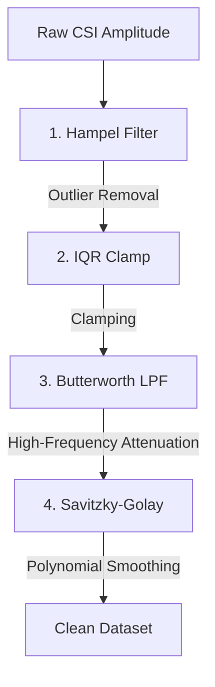

# 📡 ESP32-CAM CSI Person Tracker & Spatial Analytics

[](https://lbesson.mit-license.org/)
[](https://www.python.org/downloads/)
[](https://pytorch.org/)
[](https://docs.espressif.com/projects/esp-idf/en/release-v4.3/esp32/get-started/)

An advanced spatial analytics and positioning research repository that utilizes Wi-Fi **Channel State Information (CSI)** extracted from ESP32-CAM modules to locate and track human subjects within a 3x3m grid using a deep learning **Transformer** architecture.

> [!NOTE]
> This is a **Research & Documentation Repository** linking back to the private core implementation repository. The executable scripts in this repository have been replaced with descriptive algorithmic blueprints and structural explanations to protect proprietary logic, while preserving all environment setups and execution commands.

---

## 🗺️ Physical Layout and Experiment Setup
To collect spatial CSI amplitude signatures, the environment is mapped geometrically as follows:
* **Distance (TX - RX)**: Fixed at **5 meters**.
* **Target Area**: A **3x3 meter grid** divided into **9 cells** (each cell is exactly 1m x 1m).
* **Center (Cell 5)**: Positioned at 2.5 meters, exactly in the middle of the Tx-Rx line of sight.

```
      [ ESP32 Transmitter (TX) ]
                  |
         +---+----+---+
         | 1 |  2 | 3 |
         +---+----+---+
         | 4 | [5]| 6 |   <-- (3m x 3m Sensing Grid)
         +---+----+---+
         | 7 |  8 | 9 |
         +---+----+---+
                  |
       [ ESP32 Receiver (RX) ]
```

---

## 🧬 Data Processing & Machine Learning Pipeline

### 1. Raw Data Diagnostics & Acquisition
ESP32 outputs serial packets containing subcarrier metrics. Data is parsed and verified for format consistency:
- **Null-Byte Filtering**: High-baudrate connections over serial console can introduce transmission noise. The intake stream dynamically removes `\x00` characters.
- **Amplitude Extraction**: CSI reporting yields subcarrier values in complex numbers $(Real, Imag)$. The system transforms these to amplitudes:
  $$\text{Amplitude} = \sqrt{\text{Real}^2 + \text{Imag}^2}$$

### 2. 4-Stage Noise Reduction Pipeline
Before inputting to the Transformer network, raw CSI signals undergo a cascade of filters to remove ambient noise, high-frequency interference, and outliers:



1. **Hampel Filter (Spike Removal)**: Computes local median and Median Absolute Deviation (MAD) in a rolling window of 10 samples. Values exceeding $2.0 \times \text{MAD}$ are replaced with the median.
2. **IQR Filter (Statistical Clamp)**: Clips amplitudes beyond the Interquartile Range boundary $[Q_1 - 1.5 \times \text{IQR}, Q_3 + 1.5 \times \text{IQR}]$ to prevent extreme value distortion.
3. **Butterworth Low-Pass Filter (LPF)**: A 5th-order zero-phase low-pass filter with a normalized cutoff of $0.05$ to suppress background electromagnetic ripples.
4. **Savitzky-Golay Smooth**: Fits a 3rd-order polynomial locally in a window of 21 samples to preserve peaks and characteristics while achieving a clean curve.

### 3. Deep Learning Spatial Classification (Transformer)
The cleaned sequences are evaluated using a multi-layered Transformer Encoder model:
* **Linear Projection**: Projects 64 CSI subcarrier dimensions into $d_{\text{model}} = 128$.
* **Transformer Encoder**: 3 encoder layers with 8 attention heads ($n_{\text{head}}$) and a feed-forward size of 256.
* **Classification Head**: Extracts the final time-step hidden state, feeding it through `Linear(128 -> 64) -> ReLU -> Dropout(0.2) -> Linear(64 -> 9 Classes)`.

---

## 🛠️ Step-by-Step Execution Guide

For detailed firmware flashing and hardware parameters, see the full [ESP32 Configuration Guide](setup_esp32.md).

### Step 0: Diagnostic Verification
Check if the ESP32 is streaming clean serial logs:
```bash
python SourceCode/0_debug_serial.py
```
To record the continuous raw stream directly:
```bash
python SourceCode/0_read_serial.py
```

### Step 1: Labeled Dataset Collection
Install PySerial, stand in the designated cell, and run the collector (repeat for cells 1 to 9):
```powershell
$env:NO_PROXY="*"; pip install pyserial
python 1_collect_labeled_data.py
```

### Step 2: Signal Filtering
Clean the collected datasets using the 4-stage filter pipeline:
```cmd
set NO_PROXY=* && pip install numpy scipy
python 2_data_filtering.py
```

### Step 3: Model Training
Train the Transformer model on the cleaned CSI sequences:
```cmd
set NO_PROXY=* && pip install torch numpy
python 4_train_transformer.py
```

### Step 4: Real-time Live Prediction
Run the real-time inference loop using the trained weights:
```cmd
set NO_PROXY=* && pip install torch numpy pyserial
python 3_realtime_predict.py
```

---

## 🧠 Live Predictor Decision Tree
During real-time evaluation, the predictor uses dual confidence thresholds to guarantee tracking reliability:
* **CONF_OUT_OF_ZONE = 0.40**: If the top-1 class probability is less than 40%, the system flags `"KHÔNG TRONG VÙNG"` (Out of zone).
* **CONF_BOUNDARY = 0.06**: If the gap between the top-1 and top-2 predictions is less than 6% ($p_1 - p_2 \le 0.06$), the system flags `"GIỮA Ô X và Ô Y"` (Boundary Zone between Cell X and Y).
* **Absolute Detection**: Otherwise, the system flags `"NẰM TRONG Ô X"` (Inside Cell X).
